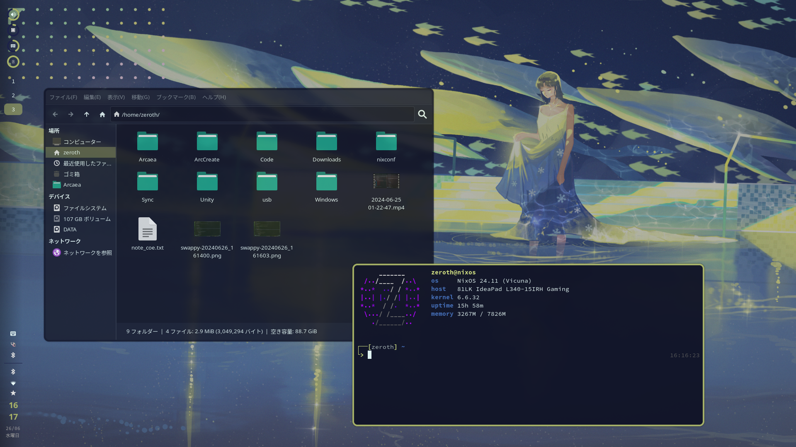
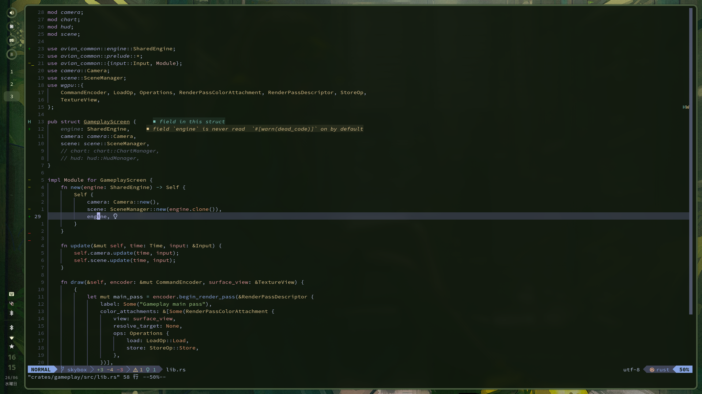
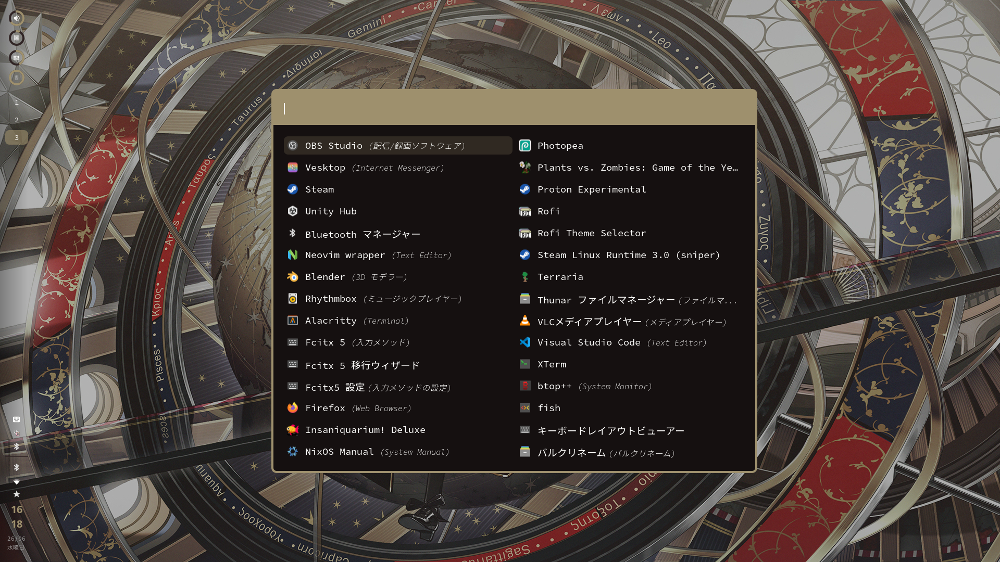

# 0thElement's NixOS configuration

Functional, beautiful and fun NixOS configuration. Featuring hyprland and wpgtk / pywal.

Disclaimer: This repository is mostly made for personal uses. You'll probably have a bad time cloning and using it as is.

### Screenshots:

### Info:
- Window manager: Hyprland
- Terminal emulator: Alacritty
- Bar + wallpaper selector: AGS
- Wallpaper: swww
- GTK theme: Linea Nord Color
- Color schemes are auto generated with wpgtk
- Shell: Fish
- Notification: None. I don't need one.
- Launcher: Rofi (wayland fork)
- Screenshot: Grim + swappy
- File explorer: Thunar
- Others: fcitx5, firefox, vesktop, syncthing

### Commands:

Assuming config files are placed in `~/nixconf`:
- Rebuild & test with `nt`
- Rebuild & switch with `ns`
- Open nix configuarion folder with `nc`
