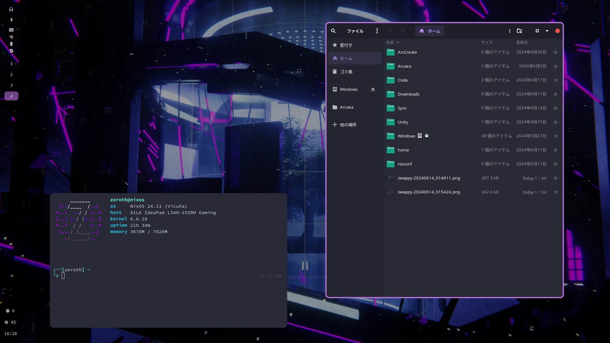
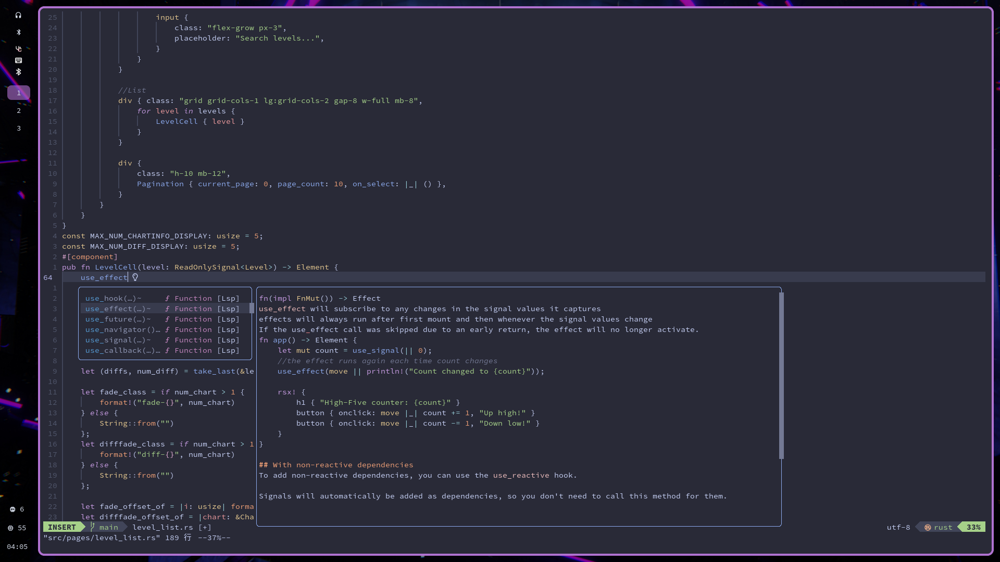

# 0thElement's NixOS configuration

Functional, look-good-enough NixOS configuration.

Disclaimer: This repository is mostly made for my personal use case. You'll probably have a bad time cloning and using it as is.

### Screenshots:

### Credits:

Transendium for the 

Original configuration based on 

### Info:
- Terminal emulator: Alacritty
- Window manager: Hyprland
- Bar: Waybar. Vertical setup
- Shell: Fish
- Notification: None. I don't need one.
- Launcher: Rofi (wayland fork)
- Wallpaper: Hyprpaper
- Screenshot: Grim + swappy
- File explorer: Nautilus
- Others: fcitx5, firefox, syncthing

### Commands:

Assuming config files are placed in `~/nixconf`:
- Rebuild & test with `nt`
- Rebuild & switch with `ns`
- Open nix configuarion folder with `nc`
